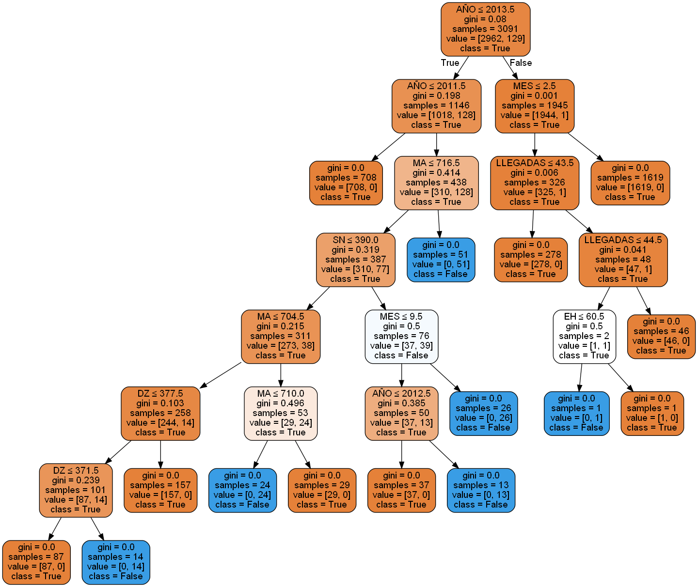

# Aprendizaje automático aplicado a la detección temprana de flujos migratorios

Código y datos asociados al Trabajo Fin de Máster de **Pablo Marín Jiménez** para el Máster Universitario en Análisis y Visualización de Datos Masivos de la Universidad Internacional de La Rioja (UNIR).

El trabajo estudia si es posible identificar **eventos migratorios masivos en la frontera sur española** mediante aprendizaje automático supervisado. Para ello combina datos históricos de cruces fronterizos de FRONTEX con indicadores de búsquedas de Google Trends en cinco países de origen o tránsito y compara dos enfoques de clasificación: un árbol de decisión **CART** y una red neuronal **MLP** (*Multi-Layer Perceptron*).

> **Nota de alcance:** este repositorio conserva el código experimental desarrollado para el TFM en 2021. Es un artefacto académico reproducible, no un sistema operativo de alerta temprana ni una herramienta destinada a tomar decisiones sobre personas o movimientos migratorios.

## Objetivo y enfoque

El objetivo principal del TFM fue elaborar y evaluar un clasificador capaz de determinar si, en un mes dado, se produce un fenómeno migratorio masivo (`FMM`). El trabajo se organizó en cinco etapas:

1. **Obtención de datos:** cruces fronterizos publicados por FRONTEX e interés de búsqueda obtenido mediante Google Trends.
2. **Preprocesado:** integración y depuración de las fuentes con Tableau Prep Builder y Excel.
3. **Modelado:** construcción de clasificadores CART y MLP.
4. **Entrenamiento y optimización:** división entrenamiento/validación y búsqueda de hiperparámetros para la red neuronal.
5. **Validación:** comparación mediante matriz de confusión, precisión y validación cruzada.

La frontera sur se representa mediante las dos rutas de FRONTEX relevantes para España:

- **Western Mediterranean Route** — Mediterráneo occidental.
- **Western African Route** — ruta de África occidental hacia Canarias.

## Datos

El archivo [`datos_complex.csv`](datos_complex.csv) contiene **4.416 registros**, con granularidad mensual entre enero de 2009 y marzo de 2021. Incluye 11 variables de entrada y la clase binaria de salida `FMM`.

| Variable | Tipo | Descripción |
|---|---|---|
| `AÑO` | Ordinal | Año de la observación. |
| `MES` | Ordinal | Mes de la observación. |
| `NACIONALIDAD` | Categórica | Nacionalidad registrada en el cruce fronterizo. |
| `LLEGADAS` | Numérica | Número de cruces detectados. |
| `MA` | Numérica | Indicador agregado de Google Trends para Marruecos. |
| `DZ` | Numérica | Indicador agregado de Google Trends para Argelia. |
| `EH` | Numérica | Indicador agregado de Google Trends para el Sáhara Occidental. |
| `MR` | Numérica | Indicador agregado de Google Trends para Mauritania. |
| `SN` | Numérica | Indicador agregado de Google Trends para Senegal. |
| `RUTA` | Categórica | Ruta migratoria de FRONTEX. |
| `TIPO` | Categórica | Tipo de frontera: terrestre (`Land`) o marítima (`Sea`). |
| `FMM` | Binaria | Etiqueta del fenómeno migratorio masivo: `TRUE` o `FALSE`. |

Distribución de la clase en el dataset incluido:

- `FALSE`: 4.221 registros.
- `TRUE`: 195 registros.

Esta distribución está fuertemente desequilibrada, una limitación relevante al interpretar las métricas. Las variables categóricas se convierten a enteros mediante `LabelEncoder` antes del entrenamiento.

### Fuentes

- **FRONTEX:** detecciones mensuales de cruces fronterizos irregulares, agregadas por nacionalidad, ruta y tipo de frontera.
- **Google Trends:** interés relativo de búsqueda para una lista de términos relacionados con migración, asilo, documentación y fronteras. Los términos usados están en [`keyword_list.csv`](keyword_list.csv).

Los códigos `MA`, `DZ`, `EH`, `MR` y `SN` siguen ISO 3166-1 alfa-2. Los valores de Google Trends son índices relativos, no volúmenes absolutos de búsquedas.

## Modelos evaluados

### Árbol de decisión CART

[`cart_complex_2506.py`](cart_complex_2506.py) realiza el siguiente flujo:

1. carga `datos_complex.csv` con separador `;`;
2. codifica las variables categóricas;
3. divide los datos en entrenamiento y validación;
4. entrena un `DecisionTreeClassifier` de scikit-learn;
5. muestra la matriz de confusión y el informe de clasificación;
6. exporta el árbol a `CARTdecisiontree.png`.



### Perceptrón multicapa

[`optimizing.py`](optimizing.py) construye redes neuronales densas con TensorFlow/Keras. El script explora:

- primera capa oculta: 32, 64 o 128 neuronas;
- segunda capa oculta: 16, 32, 64 o 128 neuronas;
- *batch size*: 32 o 64;
- épocas: 1.024 o 2.048;
- activación ReLU en capas ocultas y sigmoide en la salida;
- pérdida `binary_crossentropy` y optimizador Adam.

Cada arquitectura se evalúa mediante validación cruzada estratificada y `GridSearchCV`. Es un proceso computacionalmente costoso: ejecutarlo completo puede tardar bastante y entrenar cientos de modelos.

## Resultados del TFM

Los resultados documentados en la memoria fueron:

| Modelo | Precisión |
|---|---:|
| CART | **99,89 %** |
| MLP de referencia | 95,59 % |
| Primera optimización MLP | 98,08 % |
| Segunda optimización MLP | 98,87 % |

En el experimento presentado, **CART obtuvo la mayor precisión** y ofreció una ventaja adicional: el árbol permite inspeccionar las decisiones y comprender mejor la influencia de las variables. La MLP optimizada se aproximó a su rendimiento, pero con un coste de entrenamiento mayor y una interpretabilidad menor.

Estas cifras son los resultados históricos publicados en el TFM, no una garantía de rendimiento fuera del dataset. Deben interpretarse teniendo en cuenta:

- el reducido número de ejemplos positivos;
- el fuerte desequilibrio entre clases;
- la cantidad limitada de datos históricos;
- la dependencia de una partición concreta y del proceso de etiquetado;
- la diferencia entre un experimento académico retrospectivo y una predicción prospectiva real.

> La memoria calcula el resultado de CART con una partición 80/20. La versión actual de `cart_complex_2506.py` usa una partición 70/30, por lo que una nueva ejecución puede producir métricas distintas a las publicadas.

## Estructura del repositorio

```text
.
├── README.md
├── LICENSE
├── requirements.txt
├── datos_complex.csv          # dataset integrado usado por los modelos
├── keyword_list.csv           # términos consultados en Google Trends
├── trends.py                  # extracción de una serie de Google Trends (Senegal)
├── cart_complex_2506.py       # entrenamiento y evaluación de CART
├── optimizing.py              # búsqueda de hiperparámetros de la MLP
├── CARTdecisiontree.png       # árbol CART exportado
├── optimizacion.jpg           # resultados de la primera optimización
└── optimizacion2.jpg          # resultados de la segunda optimización
```

## Reproducción

### 1. Requisitos del sistema

El código utiliza versiones históricas de TensorFlow/Keras y de su *wrapper* para scikit-learn. Para maximizar la compatibilidad se recomienda **Python 3.10** y un entorno virtual aislado.

La exportación del árbol requiere además **Graphviz** instalado en el sistema:

```bash
# Debian/Ubuntu
sudo apt install graphviz
```

### 2. Crear el entorno

```bash
git clone https://github.com/pablo86gr/UNIR-TFM.git
cd UNIR-TFM

python3.10 -m venv .venv
source .venv/bin/activate
python -m pip install --upgrade pip
python -m pip install -r requirements.txt
```

### 3. Ejecutar CART

```bash
python cart_complex_2506.py
```

El script imprime información del dataset, la matriz de confusión y el informe de clasificación. También sobrescribe `CARTdecisiontree.png` con el árbol generado en esa ejecución.

### 4. Ejecutar la optimización MLP

```bash
python optimizing.py
```

La salida muestra, para cada arquitectura, la puntuación de validación cruzada y la mejor combinación de épocas y tamaño de lote. La ejecución completa puede requerir bastante tiempo y recursos.

### 5. Consultar Google Trends

```bash
python trends.py
```

El script original consulta cada término de `keyword_list.csv` para Senegal (`geo='SN'`) en el intervalo 2009–2021 y genera `search_trends_SN.csv`.

Google Trends no ofrece aquí una API pública estable: `pytrends` usa una interfaz no oficial, por lo que la consulta puede sufrir límites de frecuencia o dejar de funcionar si Google cambia el servicio. El dataset integrado ya está incluido y no es necesario volver a descargar Trends para ejecutar los modelos.

## Limitaciones y líneas futuras

El TFM identifica como principales líneas de continuación:

- ampliar el histórico y, especialmente, el número de casos positivos;
- incorporar fuentes actualizadas o datos en tiempo real;
- automatizar la actualización y el reentrenamiento del modelo;
- evaluar arquitecturas neuronales y modelos temporales más adecuados;
- reforzar la validación para medir generalización y estabilidad;
- profundizar en explicabilidad y en el uso ético de este tipo de predicciones.

Por la sensibilidad del dominio, cualquier evolución hacia un sistema real debería incorporar revisión humana, análisis de sesgos, trazabilidad de las fuentes, protección de datos y una evaluación explícita de posibles daños. Su finalidad razonable sería apoyar la planificación humanitaria y de recursos, nunca perfilar o perjudicar a personas migrantes.

## Autor

**Pablo Marín Jiménez**

Trabajo Fin de Máster — Máster Universitario en Análisis y Visualización de Datos Masivos, UNIR.

## Licencia

El código se distribuye bajo la licencia **GNU General Public License v2.0**. Consulta [`LICENSE`](LICENSE) para ver los términos completos.
